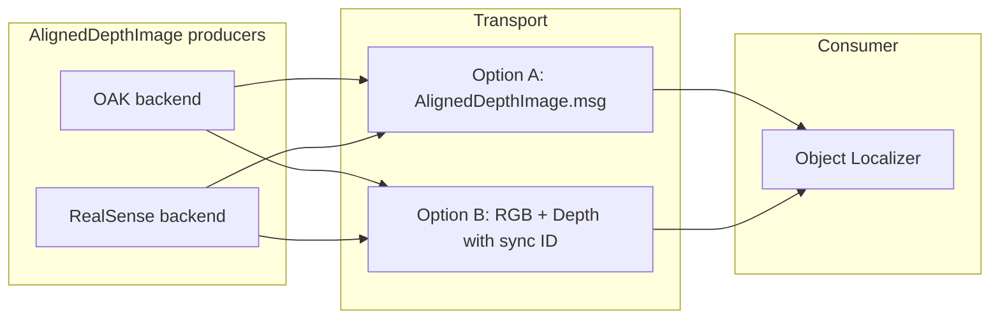

# Camera-agnostic object localizer with AlignedDepthImage

## Does the workflow make sense?

Yes. The flow is coherent:

- **AlignedDepthImage** is the contract: aligned RGB + depth + **RGB camera intrinsics (CameraInfo)** (and optionally hardware timestamp), produced by a backend that talks to either DepthAI (OAK) or pyrealsense2 (RealSense). We use **Option A**: a custom message that includes intrinsics in the msg format.
- **Object Localizer** consumes that single logical stream, runs **ultralytics YOLO** on RGB, does **depth lookup** in the aligned depth at bbox centers (or median in bbox), then **deprojects** using RGB intrinsics to produce **Detection3DArray**. No camera-specific APIs in the localizer.

You keep camera-specific features (depth–RGB alignment, hardware timestamps) inside the AlignedDepthImage producer; the localizer stays camera-agnostic.

---

## Architecture overview

- **Producers**: One node (or node type) per camera family. Each uses the same logical interface “produce AlignedDepthImage” but implements it via DepthAI or pyrealsense2 (including alignment and, if desired, hardware timestamps).
- **Transport**: Either a single custom message (Option A) or two Image topics with a sync mechanism (Option B).
- **Consumer**: One Object Localizer that subscribes to the chosen transport and runs YOLO + depth lookup + deprojection.

---

## 1. AlignedDepthImage abstraction

**Concept**: A single logical object (Option A — custom message) containing:

- RGB image (for YOLO and visualization).
- Depth image aligned to the RGB frame (same resolution and pixel correspondence).
- **RGB camera intrinsics** (`sensor_msgs/CameraInfo`) — **included in the msg format** so the localizer has K and distortion for deprojection without a separate topic.
- Optional: Hardware timestamp (for multi-sensor sync; e.g. `builtin_interfaces/Time` or uint64 nanoseconds).

**Backends**:

- **OAK (DepthAI)**: Pipeline that uses `stereo.setDepthAlign(dai.CameraBoardSocket.CAM_A)` and outputs RGB + aligned depth (e.g. from a passthrough aligned depth output). Get intrinsics from `calibData.getCameraIntrinsics(CAM_A, W, H)`. Hardware timestamps from frame getters if needed.
- **RealSense (pyrealsense2)**: Use `rs.align(rs.stream.color)` on each frameset; `align.process(frames)` yields aligned depth and color. Intrinsics from `color_frame.get_profile().as_video_stream_profile().get_intrinsics()`. Hardware timestamps from frame metadata if desired.

**Placement**: The abstraction can live as:

- A **Python interface/protocol** (e.g. “AlignedDepthImageProducer”) plus two implementations (OAK, RealSense) used by:
  - **Option A**: One “aligned depth” node that takes a parameter (camera type / device id) and publishes the chosen message type, or
  - Separate **oak_aligned_node** and **realsense_aligned_node** that both publish the same topic layout.

Existing [oak.py](src/perception/perception/nodes/oak.py) and [realsense.py](src/perception/perception/nodes/realsense.py) currently publish **unaligned** depth (OAK: left mono frame; RealSense: depth sensor frame). So either:

- Add aligned outputs (and optionally AlignedDepthImage publishing) alongside existing raw topics, or
- Introduce new nodes that only publish aligned data. The plan below assumes **new aligned publisher node(s)** so existing behavior stays unchanged; you can later refactor to a single parameterized node if you prefer.

---

## 2. Chosen approach: Option A (custom AlignedDepthImage.msg)

We use **Option A**. The custom message format is:

- **Message**: `AlignedDepthImage.msg` with:
  - `sensor_msgs/Image rgb`
  - `sensor_msgs/Image depth`
  - `**sensor_msgs/CameraInfo camera_info`** — **included (intrinsics for the RGB frame; required for deprojection in the localizer).
  - `builtin_interfaces/Time hardware_stamp` (optional, for multi-sensor sync).
- **Sync**: Atomic — one msg = one aligned (RGB, depth, intrinsics) pair.
- **Intrinsics**: Always present in the same msg; the Object Localizer reads K (and distortion if needed) from `camera_info` in one callback.
- **Hardware timestamp**: Optional field in the msg when the backend provides it.

## 3. Intrinsics and hardware timestamps

- **Intrinsics**: The **RGB** camera intrinsics are **included in the AlignedDepthImage.msg** as `sensor_msgs/CameraInfo camera_info`. The localizer uses this for deprojection (K and optionally distortion) with no separate topic or param.
- **Hardware timestamps**: Add an optional field (e.g. `builtin_interfaces/Time hardware_stamp` or `uint64 hardware_stamp_ns`) to the AlignedDepthImage msg so downstream (e.g. state estimation, logging) can use them; keep `header.stamp` as the ROS receipt/publish time if you prefer.

---

## 4. Object Localizer (camera-agnostic)

- **Input**: AlignedDepthImage (Option A) — one subscription; intrinsics come from `msg.camera_info`.
- **Steps**:
  1. Run **ultralytics YOLO** on the RGB image (same pattern as [object_detections.py](src/perception/perception/nodes/object_detections.py)).
  2. For each Detection2D (bbox), get depth at the bbox center (or median over a small region) from the **aligned** depth image; handle invalid/zero depth.
  3. **Deproject** pixel (u, v) + depth z using RGB intrinsics from `msg.camera_info` (K matrix): `x = (u - cx) * z / fx`, etc., and fill `Detection3D.bbox.center` and size (reuse the same math as in [objects_localizer.py](src/perception/perception/nodes/objects_localizer.py) lines 271–298).
  4. Publish **Detection3DArray** on e.g. `detections3d` (same as current objects_localizer for compatibility with [view_detections_3d.py](src/perception/perception/nodes/test/view_detections_3d.py)).
- **Config**: Model path and optional target class filter (e.g. “person”) similar to object_detections; input topic via params or remaps.

This gives a single camera-agnostic localizer that works with any AlignedDepthImage source (OAK or RealSense).

---

## 5. Implementation plan (concrete steps)

1. **Define AlignedDepthImage message (Option A)**

- Add `msg/AlignedDepthImage.msg` in [src/msgs](src/msgs) with:
  - `sensor_msgs/Image rgb`
  - `sensor_msgs/Image depth`
  - `**sensor_msgs/CameraInfo camera_info` (required — intrinsics for RGB frame)
  - `builtin_interfaces/Time hardware_stamp` (optional)
- Update [src/msgs/CMakeLists.txt](src/msgs/CMakeLists.txt) and add `sensor_msgs` and `builtin_interfaces` to dependencies; build.

1. **AlignedDepthImage producer interface and backends**

- In perception (e.g. `perception/utils/` or `perception/nodes/`): define a small interface (e.g. “yield (rgb, depth, camera_info, hardware_stamp)” or a dataclass).
- Implement **OAK backend**: pipeline with RGB + `setDepthAlign(CAM_A)`, passthrough aligned depth, and `getCameraIntrinsics(CAM_A, W, H)`; optional hardware timestamp from frame.
- Implement **RealSense backend**: `rs.align(rs.stream.color)`, then aligned depth and color; intrinsics from color stream profile; optional hardware timestamp.
- Wire backends into a single **aligned publisher node** that takes camera type (oak/realsense) and device id, runs the correct backend, and publishes **AlignedDepthImage** (Option A) including `camera_info` filled from backend intrinsics.

1. **Object Localizer node**

- New node (e.g. `object_localizer.py` or refactor name from `objects_localizer.py`) that:
  - Subscribes to **AlignedDepthImage** only; reads RGB, depth, and intrinsics from `msg.camera_info`.
  - Uses ultralytics YOLO on RGB, depth lookup on aligned depth, deprojection using K from `camera_info`.
  - Publishes Detection3DArray.
- Reuse YOLO loading and bbox conversion from [object_detections.py](src/perception/perception/nodes/object_detections.py) and deprojection logic from [objects_localizer.py](src/perception/perception/nodes/objects_localizer.py) (adapt to K from `msg.camera_info.k`).

1. **Launch and config**

- Launch the aligned publisher (OAK or RealSense) and the new Object Localizer; ensure topics and frame_ids match (e.g. `detections3d` for view_detections_3d).
- Add any needed intrinsics or CameraInfo publishing from the aligned backends (or from calibration files) so the localizer always has K for the RGB frame.

1. **Optional: keep current OAK-only localizer**

- Leave [objects_localizer.py](src/perception/perception/nodes/objects_localizer.py) as-is for OAK-only, on-device YOLO use cases; the new node becomes the default for camera-agnostic, ultralytics-based 3D detections.

---

## 6. File and topic summary

- **New/updated**
  - `src/msgs/msg/AlignedDepthImage.msg` (Option A).
  - Perception: aligned producer interface + OAK backend + RealSense backend + one aligned publisher node.
  - Perception: new camera-agnostic `object_localizer` node (ultralytics + depth + deprojection).
- **Topics (example)**
  - Aligned publisher: `/camera/{key}/aligned` (AlignedDepthImage — includes rgb, depth, and camera_info).
  - Object Localizer: subscribes to `/camera/{key}/aligned`; publishes `detections3d` (Detection3DArray).

This keeps depth–RGB alignment and hardware timestamps inside the AlignedDepthImage layer and gives you a single, camera-agnostic object localizer that uses your existing hardware-agnostic YOLO (ultralytics) plus depth lookup and deprojection.
