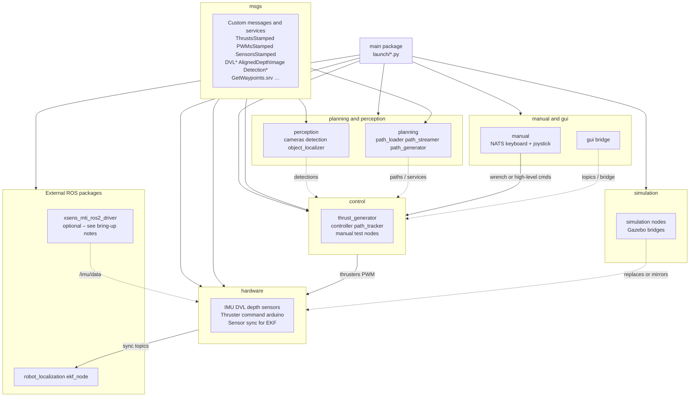

# RoboSub

Stanford RoboSub autonomy stack for our AUV: sensing, state estimation, planning, control, perception, manual override, simulation, and operator GUI. The codebase is a **colcon workspace**: ROS 2 **Jazzy** packages under `src/`, with shared interfaces in **`msgs`**.

---

## New member onboarding

Use this page as a map of the repo. The **diagrams below** show how packages relate; deep dives live in linked docs.

| Step | Action |
|------|--------|
| 1 | Clone this repository into your ROS 2 workspace (commonly `ros2_ws/src/`). |
| 2 | Open in **VS Code** and use **Dev Containers** (folder `.devcontainer/`) for a reproducible environment, or install ROS 2 Jazzy + dependencies manually (see [DEPENDENCY_MANAGEMENT.md](DEPENDENCY_MANAGEMENT.md)). |
| 3 | From the **repository root** (directory containing `build.sh`), run `./build.sh && source install/setup.bash`. |
| 4 | Skim **Package map** and **Runtime data flow** below, then open the doc for the subsystem you will work on. |
| 5 | Use `ros2 launch main …` for bring-up (see [Running](#running)). Explore the live graph with `ros2 run rqt_graph rqt_graph`. |

**Version warning:** Many tutorials online target older ROS / Gazebo releases. Use documentation for **ROS 2 Jazzy** and **Gazebo Harmonic** only.

---

## Repository layout

High-level directory structure:

```text
RoboSub/                          # colcon workspace root (run build.sh here)
├── .devcontainer/                 # VS Code dev container (Dockerfile, devcontainer.json)
├── build.sh                       # colcon build (--merge-install, symlink-install)
├── test.sh                        # workspace tests
├── requirements.txt               # Python deps (often used by devcontainer post-create)
├── DEPENDENCY_MANAGEMENT.md       # apt / venv / GPU / PyTorch layers
├── keyboard_local.sh              # Host keyboard → NATS (uses .local_venv + local_requirements.txt)
├── joystick_local.sh
├── local_requirements.txt         # pynput, etc. for host teleop scripts
├── onboarding/                  # New-member tutorials (path YAML walkthrough)
├── SIMULATION.md                  # Gazebo Harmonic + host bridge
├── README.md                      # this file
└── src/
    ├── main/                      # Top-level launch files only (package: main)
    ├── msgs/                      # Custom .msg / .srv (ThrustsStamped, DVL*, AlignedDepthImage, …)
    ├── hardware/                  # Drivers & hardware-facing nodes (IMU bridge, DVL, thrusters, Teensy)
    ├── control/                   # Wrench ↔ thrust allocation, PID controller, path tracking helpers
    ├── planning/                  # Path YAML loading, path streaming utilities
    ├── perception/                # Cameras, aligned depth, object detection / localizer
    ├── manual/                    # NATS keyboard + joystick ROS nodes; keyboard_local / joystick_local
    ├── simulation/                # Gazebo-oriented bridge nodes (sensors, thrusters, path)
    └── gui/                       # Web HUD ↔ ROS bridge
```

Generated folders after build: `build/`, `install/`, `log/` (standard colcon output).

---

## Architecture (packages and responsibilities)



---

## Runtime data flow (simplified)

Typical signals on the vehicle (names align with `main/launch/params/global.yaml` where applicable):

```mermaid
flowchart LR
    subgraph sensors_raw [Raw sensors]
        IMU_B[/imu/data]
        DVL_R[dvl topic]
        DEPTH[depth / pressure]
    end

    subgraph sync [hardware / sensors node]
        TW[/dvl/twist_sync]
        Z[/depth/pose_sync]
    end

    subgraph estimate [EKF]
        ODOM[/odometry/filtered]
    end

    subgraph control_loop [Control]
        WP[waypoint]
        W[/wrench]
        TH[/thrusts]
    end

    subgraph actuation [Thrusters]
        PWM[PWM / Teensy]
    end

    IMU_B --> estimate
    DVL_R --> sync --> TW --> estimate
    DEPTH --> sync --> Z --> estimate
    estimate --> ODOM
    WP --> control_loop
    ODOM --> control_loop
    control_loop --> W --> TH --> PWM
```

**Perception** publishes detections and 3D hypotheses using `msgs` types; wiring is node-specific — see [src/perception/README.md](src/perception/README.md).

**Path tracking:** `path_tracker` expects a `get_waypoints` service (`msgs/srv/GetWaypoints.srv`). There is no default server node in this repository yet; `ros2 launch main control.py` currently pairs **`test_controller`** (sample waypoints) with **`controller`** for a working demo loop. For full missions, implement or launch a waypoint provider and enable `path_tracker` in `main/launch/control.py`.

---

## Package map

| Package | Role |
|---------|------|
| **main** | Aggregates subsystems: `main.py` (hardware + localization + **control**; `manual.py` is commented out), plus standalone `control.py`, `hardware.py`, `manual.py`, etc. Installs `launch/` and `launch/params/global.yaml`. |
| **msgs** | All custom interfaces; any new cross-package types should live here. |
| **hardware** | `thrusters`, `imu`, `dvl`, `sensors` (sync/publish for EKF), `arduino`, plotting utilities. Depends on messages in `msgs`. |
| **control** | `thrust_generator` (`/wrench` → `/thrusts`), `controller` (`/odometry/filtered` + `waypoint` → `wrench`), `path_tracker`, PID and trajectory helpers. See [src/control/README.md](src/control/README.md). |
| **planning** | `path_loader`, `path_streamer`, `path_generator` — YAML paths and streaming (see `planning/sample_path.yaml`). |
| **perception** | RealSense / OAK pipelines, `AlignedDepthImage`, object detection and `object_local`. See [src/perception/README.md](src/perception/README.md). |
| **manual** | **`keyboard`** and **`joystick`** nodes (NATS → `wrench`); host scripts **`keyboard_local.sh`** / **`joystick_local.sh`**. |
| **simulation** | Nodes to talk to Gazebo / sim bridges (`sensors`, `thrusters`, `path_bridge`). See [SIMULATION.md](SIMULATION.md). |
| **gui** | `ros2 run gui bridge` — web HUD plumbing (`gui/auv_hud.html`, `gui/gui/ros2_gui_bridge.py`). |

---

## Documentation index

| Document | Description |
|----------|-------------|
| [main](src/main/README.md) | Top-level launch files and `global.yaml` |
| [msgs](src/msgs/README.md) | Custom messages and services |
| [hardware](src/hardware/README.md) | IMU/DVL/thrusters/Arduino nodes |
| [control](src/control/README.md) | Thrust allocation, controller, PID, path tracker |
| [planning](src/planning/README.md) | Path loader, generator, streamer |
| [Onboarding: path YAML](onboarding/README.md) | Author `sample_path`-style YAML, visualize, run ROS pipeline |
| [perception](src/perception/README.md) | Cameras, aligned depth, object localizer |
| [manual](src/manual/README.md) | Keyboard teleop (default); optional joystick (NATS) |
| [simulation](src/simulation/README.md) | Gazebo bridge nodes; nested [custom_gz_plugins](src/simulation/simulation/custom_gz_plugins/README.md) |
| [gui](src/gui/README.md) | Web HUD WebSocket bridge |
| [Dependency Management](DEPENDENCY_MANAGEMENT.md) | apt, venv, system Python, PyTorch / GPU |
| [Simulation](SIMULATION.md) | Gazebo Harmonic, Docker ↔ host bridge |

Additional notes in tree: `src/control/control.md`, `src/perception/perception.md`, `src/planning/planning.md`, `src/simulation/simulation.md`, `src/gui/gui.md`, `src/manual/manual.md`.

---

## Installation

1. Install [Docker Desktop](https://www.docker.com/products/docker-desktop) (or Docker Engine) if you use the dev container.
2. Clone this repository (replace URL with your team’s canonical remote):

   ```bash
   git clone <YOUR_ROBOSUB_GIT_URL>
   ```

3. In VS Code: **Command Palette** → **Dev Containers: Reopen in Container** if using `.devcontainer/`.
4. Install Gazebo / simulation prerequisites per [SIMULATION.md](SIMULATION.md) when doing sim work outside the container.

---

## Building

From the **repository root**:

```bash
./build.sh && source install/setup.bash
```

You may see `jobserver unavailable` warnings from parallel builds; they are usually safe to ignore.

---

## Running

Always `source install/setup.bash` (from this workspace’s `install/`) in each new shell.

### Permissions and USB

For hardware access, run `./ports.sh` from the repo root when instructed by your team (device permissions / udev).

### Launch files (correct paths)

Top-level launches are installed with package **`main`**. Prefer:

```bash
ros2 launch main main.py
ros2 launch main control.py
ros2 launch main hardware.py
ros2 launch main manual.py
ros2 launch main perception.py
ros2 launch main localization.py
ros2 launch main state.py
```

Subsystem packages may also expose launches, for example:

```bash
ros2 launch perception camera.py
ros2 launch control control.py
```

### `main.py` composition

`main/launch/main.py` includes **hardware** (sensors + actuation + **`thrust_generator`**), **localization**, and **`control.py`** ( **`controller`** + **`test_controller`** only — **`thrust_generator` is not duplicated** here; it comes from `hardware.py`). **`manual.py` is commented out**, so **autonomy does not start keyboard or joystick**. For teleop, use a separate session with **`hardware.py`** + **`ros2 run manual keyboard`** + **`keyboard_local.sh`** (or **`manual.py`** for bench thrust + keyboard), and **stop teleop before** switching to **`main.py`** if you share the same machine. See [onboarding README](onboarding/README.md#robot-bring-up-hardware-keyboard-teleop-autonomy).

### Hardware launch and Xsens

`main/launch/hardware.py` starts **`xsens_mti_ros2_driver`** in addition to `hardware` and `control` nodes. That package must be present in the same workspace (or overlay) and built. If you do not have the Xsens driver, use a reduced bring-up (e.g. comment those nodes or maintain a fork of `hardware.py` for your bench setup).

### Other ROS dependencies

`main/launch/localization.py` (and `state.py`) run **`robot_localization`**’s `ekf_node`. Install the **ROS 2 Jazzy** package on your system or add it to the workspace overlay if missing, for example: `sudo apt install ros-jazzy-robot-localization`.

### Run a single node

```bash
ros2 run PACKAGE_NAME EXECUTABLE_NAME
```

Examples:

```bash
ros2 run control test_thrust
ros2 run manual keyboard
```

Executable names come from each package’s `setup.py` (`console_scripts`). New Python nodes: add under `PACKAGE/nodes/`, register in `setup.py`, rebuild.

---

## Simulation

Simulation is GUI-heavy; teams often run Gazebo on a host or VM and bridge into Docker. Follow [SIMULATION.md](SIMULATION.md). Historical references to `./sim.sh` may apply to your team’s VM layout — if the script is absent, use the flows described in that doc.

---

## Optional: Joystick over NATS

**`manual/joystick`** uses **`nats://localhost:4222`**, subject **`joystick`**. Run **`control/thrust_generator`** once (e.g. from **`hardware.py`** or **`manual.py`**), then **`ros2 run manual joystick`** and **`./joystick_local.sh`**. Do **not** run joystick/keyboard together with the **`main.py`** autonomy stack on the same bring-up if you want only controller wrenches on **`/wrench`**.

---

## Manual keyboard control (default)

**Stack:** **`nats-server`** → ROS **`manual/keyboard`** (subscribe **`keyboard`**) → **`/wrench`** → **`thrust_generator`** → **`/thrusts`** → thrusters / Arduino.

**Vehicle teleop** (not the same process tree as **`main.py`** autonomy — stop teleop when running full autonomy):

```bash
nats-server
ros2 launch main hardware.py
ros2 run manual keyboard
./keyboard_local.sh
```

**Bench** (`manual.py` starts **`thrust_generator`** + **`keyboard`**):

```bash
nats-server
ros2 launch main manual.py
./keyboard_local.sh
```

Do **not** launch **`manual.py`** together with **`hardware.py`** — both start **`thrust_generator`**. Use **`hardware.py`** + **`ros2 run manual keyboard`** on the vehicle instead.

Host script **`keyboard_local.sh`** uses **`.local_venv`** and **`pynput`** (see **`local_requirements.txt`**). NATS must be reachable from both the ROS container/host and the machine running **`keyboard_local`**.

Full procedure: [onboarding/README.md](onboarding/README.md#robot-bring-up-hardware-keyboard-teleop-autonomy).

---

## Cameras and logging

```bash
ros2 launch perception camera.py
# When ready:
ros2 run perception camera_viewer
# Record:
./record_cameras.sh PATH_TO_RECORDING
# Playback:
ros2 bag play PATH_TO_RECORDING
```

---

## ROS graph

After launching:

```bash
ros2 run rqt_graph rqt_graph
```

---

## Testing

```bash
./test.sh
```

For PEP 257 detail:

```bash
ament_pep257
```

---

## FAQ and troubleshooting

### Display / X11 (XQuartz, xcb)

1. Ensure XQuartz is running on macOS and run `xhost +` (or scoped `xhost`) on the host.
2. On the SSH host: `echo $DISPLAY` and export the same `DISPLAY` inside the container if needed.
3. Test with `xeyes` on the target machine when diagnosing.

### Qt `xcb` plugin errors

Reboot the VM/host, restart the container, and retry.

### Low disk space

Keep **≥ ~30 GB** free for Docker and builds. Prune if needed (host / VM):

```bash
sudo docker system prune -a -f
```

### Sensor permissions

1. Attach USB devices to Linux / the VM when prompted.
2. If needed:

   ```bash
   sudo chmod a+rw /dev/ttyACM0
   ```

3. **IMU (Xsens) / kernel module** workflows are hardware-specific; follow team docs for `xsens_mt` / power rules (e.g. DVL vs wall power).

---

## Contributing quick reference

- Match **ROS 2 Jazzy** APIs and colcon / ament patterns used in existing packages.
- **New messages:** extend `src/msgs`, rebuild before using in Python/C++.
- **New nodes:** place under the right package’s `nodes/`, register in that package’s `setup.py`, add tests under `PACKAGE/test/` where appropriate.
- Prefer small PRs with a clear subsystem scope (perception, control, etc.).

---

## License

License declarations in individual `package.xml` files are the source of truth until a repo-wide policy is finalized.
