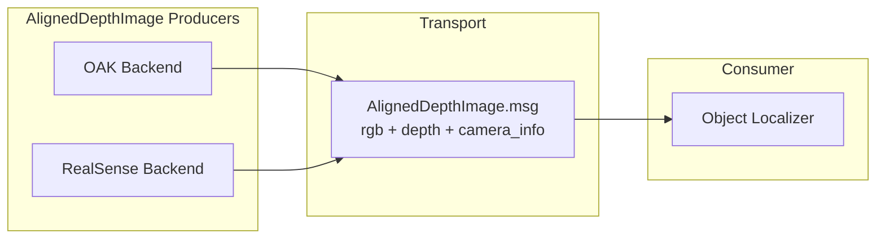

# Perception

This package handles all computer vision and sensor processing for the AUV, including camera input, object detection, 3D localization, and depth estimation.

---

## Architecture

The perception stack is built around an **AlignedDepthImage** abstraction that decouples camera-specific hardware from downstream vision processing.



- **Producers**: One node per camera family. Each implements the same interface — publish `AlignedDepthImage` — but uses DepthAI (OAK) or pyrealsense2 (RealSense) under the hood.
- **Transport**: A single custom `AlignedDepthImage.msg` carrying aligned RGB, aligned depth, and RGB camera intrinsics atomically.
- **Consumer**: A camera-agnostic Object Localizer that subscribes to `AlignedDepthImage` and outputs `Detection3DArray`.

---

## Nodes

### `aligned_publisher`

Publishes `AlignedDepthImage` messages from either an OAK-D or RealSense camera. Configured via the `camera_type` parameter (`oak` or `realsense`).

**Publishes**: `/camera/{key}/aligned` (`msgs/AlignedDepthImage`)

**OAK backend**: Uses `stereo.setDepthAlign(dai.CameraBoardSocket.CAM_A)` to align depth to the RGB frame. Intrinsics are read from `calibData.getCameraIntrinsics(CAM_A, W, H)`.

**RealSense backend**: Uses `rs.align(rs.stream.color)` on each frameset. Intrinsics are read from `color_frame.get_profile().as_video_stream_profile().get_intrinsics()`.

---

### `object_localizer`

Camera-agnostic 3D object detector. Subscribes to `AlignedDepthImage`, runs ultralytics YOLO on the RGB image, looks up depth at each detection bounding box center, and deprojects to 3D using the intrinsics embedded in the message.

**Subscribes**: `/camera/{key}/aligned` (`msgs/AlignedDepthImage`)  
**Publishes**: `detections3d` (`vision_msgs/Detection3DArray`)

**Detection pipeline**:
1. Run YOLO on `msg.rgb` to get 2D bounding boxes.
2. For each bbox, sample depth from `msg.depth` at the center pixel (or median over a small region); discard zero/invalid readings.
3. Deproject pixel `(u, v)` + depth `z` using RGB intrinsics `K` from `msg.camera_info`:
   ```
   x = (u - cx) * z / fx
   y = (v - cy) * z / fy
   ```
4. Fill `Detection3D.bbox.center` and publish as `Detection3DArray`.

**Configuration** (ROS2 parameters):
- `model_path` — path to `.pt` YOLO weights file.
- `target_classes` — optional list of class names to filter detections.
- Input topic remapped via launch or `--ros-args -r`.

---

### `oak` / `realsense` (legacy)

Original camera nodes that publish **unaligned** raw RGB and depth streams. Still used for raw data recording and OAK-only on-device YOLO workflows. See `nodes/oak.py` and `nodes/realsense.py`.

---

### `objects_localizer` (legacy, OAK-only)

Original OAK-only 3D localizer using on-device YOLO. Kept as-is for OAK-specific workflows. The new camera-agnostic `object_localizer` is the preferred node for ultralytics-based detection.

---

## Custom Messages

### `AlignedDepthImage.msg` (`src/msgs/msg/AlignedDepthImage.msg`)

| Field | Type | Description |
|---|---|---|
| `rgb` | `sensor_msgs/Image` | RGB image from the color camera |
| `depth` | `sensor_msgs/Image` | Depth image aligned to the RGB frame |
| `camera_info` | `sensor_msgs/CameraInfo` | RGB camera intrinsics (K matrix, distortion) required for deprojection |
| `hardware_stamp` | `builtin_interfaces/Time` | Optional hardware timestamp for multi-sensor synchronization |

One `AlignedDepthImage` message = one atomically aligned (RGB, depth, intrinsics) tuple.

---

## Topics Summary

| Topic | Type | Direction | Description |
|---|---|---|---|
| `/camera/{key}/aligned` | `msgs/AlignedDepthImage` | Published | Aligned RGB + depth + intrinsics |
| `detections3d` | `vision_msgs/Detection3DArray` | Published | 3D object detections in camera frame |

---

## Launch

```bash
# Launch aligned publisher + object localizer (OAK camera)
ros2 launch perception camera_localizer.py camera_type:=oak

# Launch with RealSense
ros2 launch perception camera_localizer.py camera_type:=realsense

# View 3D detections
ros2 run perception view_detections_3d
```

---

## Development Notes

- Camera-specific details (alignment, hardware timestamps, intrinsics) live entirely inside the `aligned_publisher` node. The `object_localizer` has no camera-specific code.
- Do not add `torch` or `ultralytics` to `setup.py`'s `install_requires`. These must be installed as system Python packages to ensure GPU support. See [DEPENDENCY_MANAGEMENT.md](/DEPENDENCY_MANAGEMENT.md).
- When adding a new camera backend, implement the aligned producer interface and publish the same `AlignedDepthImage` topic — no changes required in `object_localizer`.
